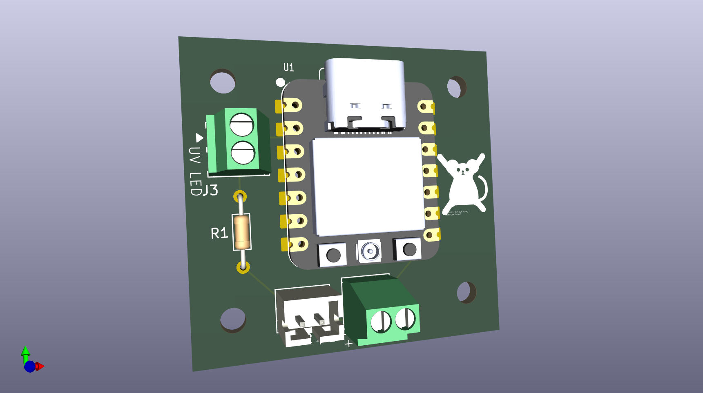

# Mouse Deterrent Device

A mouse decided it liked the space under the hood of my car. Supposedly, they don't like ultraviolet light, so I designed a small device that could go in there to deter critters from settling in at night.

## What it does

- Connects to home wifi
- Gets the current time via NTP
- Gets sunrise and sunset times from the [SunriseSunset.io](https://sunrisesunset.io/) API
- If it's daytime, goes into battery-saving deep sleep until sunset
- If it's night, light the UV LED, and go into a lighter sleep mode until sunrise to save some battery

## Hardware

- [Seeed Studio XIAO ESP32-C6](https://www.seeedstudio.com/Seeed-Studio-XIAO-ESP32C6-p-5884.html)
- A battery (soldered to pads on Xiao) or USB battery pack
- Ultraviolet LED (like [this one](https://www.jameco.com/webapp/wcs/stores/servlet/ProductDisplay?catalogId=10001&langId=-1&storeId=10001&productId=2274823))
- Resistor appropriate for your UV LED (4.7 Ω for the one linked above)

## Circuit schematics and PCB

PCB design files for [KiCad](https://www.kicad.org/) are in `PCB` folder.

(This render shows a slightly different Xiao board, not the ESP32-C6 version.)

[Mouse image](https://thenounproject.com/icon/mouse-7950563/) by Kim Sun Young from [Noun Project](https://thenounproject.com/browse/icons/term/mouse/) ([CC BY 3.0](https://creativecommons.org/licenses/by/3.0/)).

## Software

- [CircuitPython](https://circuitpython.org/)
  - [adafruit_connection_manager](https://docs.circuitpython.org/projects/connectionmanager/en/latest/index.html)
  - [adafruit_ntp](https://docs.circuitpython.org/projects/ntp/en/latest/index.html)
  - [adafruit_requests](https://docs.circuitpython.org/projects/requests/en/latest/index.html)
- Powered by [SunriseSunset.io](https://sunrisesunset.io/)'s sunrise/sunset API.
